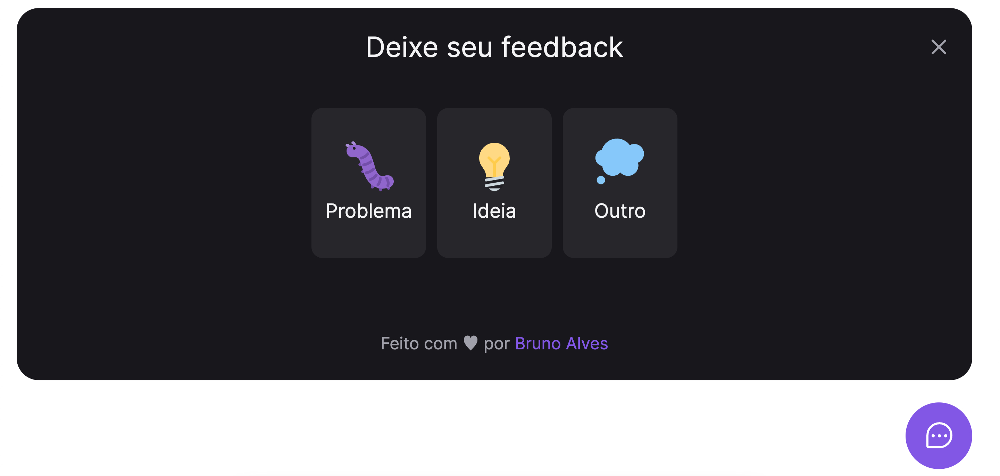
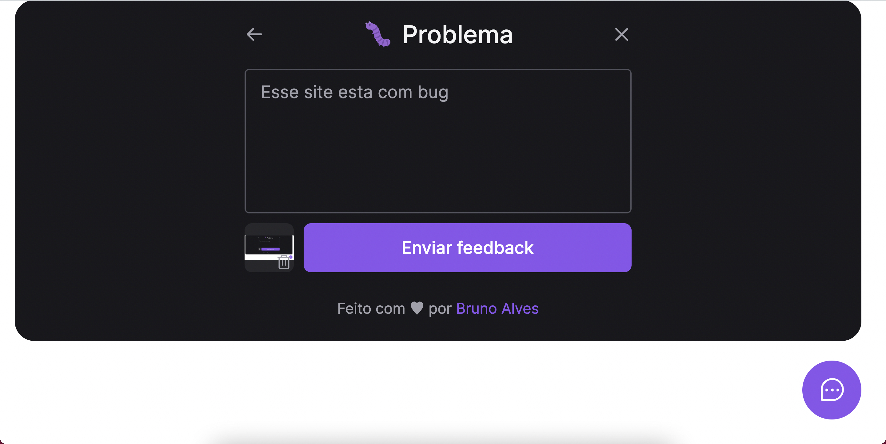

<p align="center">
  
  
</p>

<p align="center">
  
  
  

  
</p>

<h1 align="center">
</h1>

<br>

# FRONTEND

## 🧪 Technologies

This project was developed using the following technologies:

- [ReactJS](https://reactjs.org/)
- [Tailwind Css](https://tailwindcss.com/)
- [Vite](https://vitejs.dev/)
- [PhosphorIcons](https://phosphoricons.com/)

## 🚀 Getting started

Clone the project and access the folder.

```bash
git clone https://github.com/NitoBa/nlw-return-impulse.git

cd nlw-return-impulse/web
```

Run this command to install the dependencies.

```bash
npm install

npm run dev
```

Run this command to build to production

```bash
npm run build

npm preview
```

This project is integrated with backend built in NodeJS.
That you can access by click [here](https://github.com/NitoBa/nlw-return-impulse/tree/main/server).

Create the .env.local in your project and replace the environment variable with your own
You can view the example in .env.example file on root of the project

```bash
VITE_API_URL = "http://localhost:3333/"
```


## 🔖 Layout

You can view the project through the links below:

- [Live Preview](https://nlw-return-impulse-omega.vercel.app/)


# BACKEND

## 🧪 Technologies

This project was developed using the following technologies:

- [NodeJS](https://nodejs.org/)
- [Express](https://expressjs.com/)
- [Prisma](https://prisma.io/)
- [Nodemailer](https://nodemailer.com/about/)
- [MailTrap](https://mailtrap.io/)
- [Docker](https://docker.com/)
- [Jest](https://jestjs.io/pt-BR/)

## 🚀 Getting started

Clone the project and access the folder.

```bash
git clone https://github.com/NitoBa/nlw-return-impulse.git

cd nlw-return-impulse/server
```

Run this command to install the dependencies.

```bash
npm install
```

Run migrations on database and generate types of prisma

```bash
npx prisma migrate dev
npx prisma generate
```

Run project in development environment.

```bash
npm run dev
```

## 🐳 Build and run project using Docker

```bash
docker build -t feedwidget-server .

docker run -p 3333:3333 --name feedwidget-server-app feedwidget-server  
```


## 📝 License

This project is licensed under the MIT License. See the [LICENSE](LICENSE) file for details.

---

Made with 💜 by [Bruno Alves](https://profile-website-murex.vercel.app/) 👋
